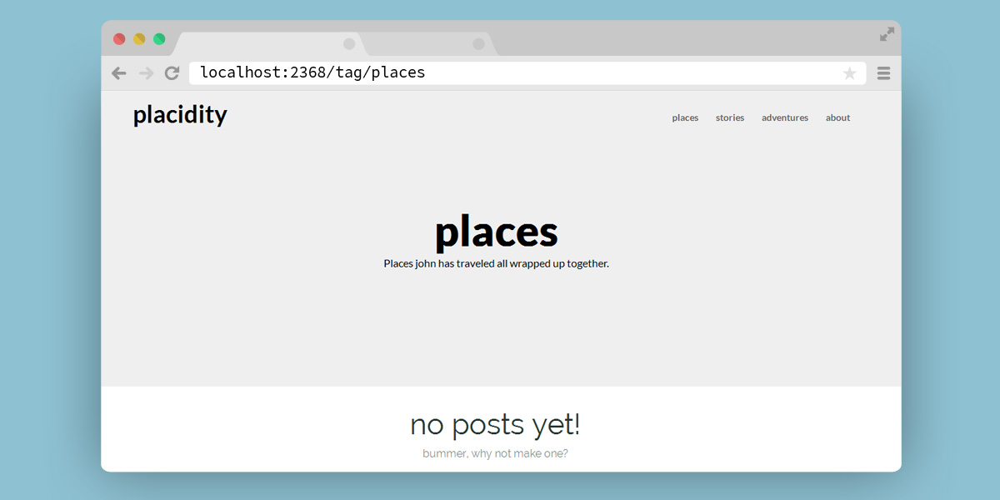

# Placidity

A free, Image Heavy Ghost theme.

if you see a bug or have a great idea on how to improve Placidity, Dont hesitate to [create a new issue](https://github.com/DanielTamkin/placidity/issues) or Tweet me [@CodeHands](https://twitter.com/CodeHands)

### Installation
 1. Install Placidity to your Themes directory located at `ghost\content\themes`
 2. login to your ghost admin panel.
 3. navigate to your `settings/general` panel.
 4. Change your Theme setting to `Placidity`

### Home

### Loop

## Tag

### Post

### Suggested Reads

Details
---
| Fonts  | jQuery plugins |
| ------------- | ------------- |
| [Lato](https://www.google.com/fonts#UsePlace:use/Collection:Lato)  | [centerThis.js](https://github.com/DanielTamkin/centerThis.js)  |
| [Raleway](https://www.google.com/fonts#UsePlace:use/Collection:Raleway)  | [AnchorSlide.js](https://github.com/DanielTamkin/AnchorSlide.js)  |
